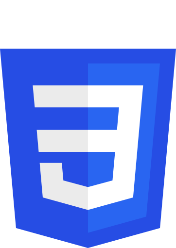
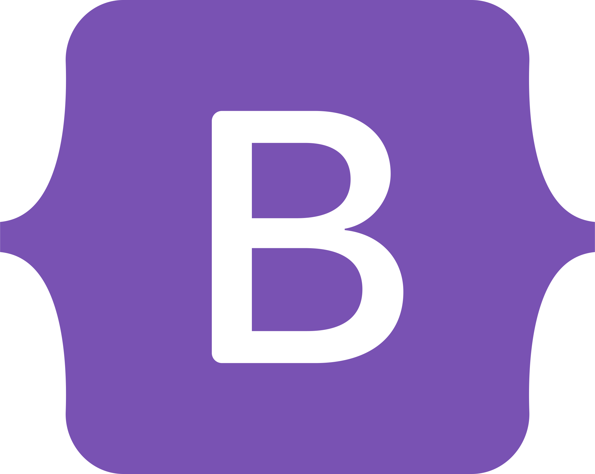
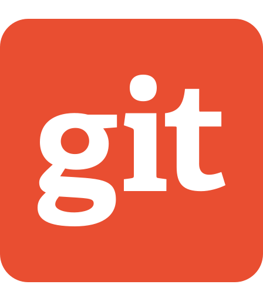

# Juuso "korho" Korhonen

 
 

## About me

💼 Entrepreneur, sole trader, [Bittivirta](https://bittivirta.fi) 
🧑🏼‍💻 Looking for a job (Hire me, or contact for a quote) 
🤓 Geek since for ever, started programming as an 14 years old kid, 2014 
🖨 Good knowledge of IT, fast-phased learner 
🧁 Good baker and cook, give me a recipe and I'll nail it (some times second try better though) 
🔍 Tends to take notice on things people normally don't 
🔋 Charging batteries by working in a team and alone (I need variety) 
🙂 Socially smart, trying always to be friendly to everyone 
👒 Always killing with kindess

🇫🇮 From Valkeakoski, Finland 
🏳 Finnish as native language, very good grammar 
🏳 Very good English grammar and looking to improve on spoken language

 

## SSH Keys

If I've requested you to add my SSH keys to your server, you can get them here: [https://github.com/korhox.keys](https://github.com/korhox.keys).

:warning: Please remove my access to your server after we have finished our cooperation to maximize your safety.

 

## Contact me

Ask me anything, offer for a job or ask for a quote through an email [juuso@korho.fi](juuso@korho.fi)!

 

## Known programming and markup languages

|                                                                                                                                                                                                                                              | Language     | Skill Level                    | Experience Level   | Improving needed on                           |
|----------------------------------------------------------------------------------------------------------------------------------------------------------------------------------------------------------------------------------------------|--------------|--------------------------------|--------------------|-----------------------------------------------|
| 
<picture><source media="(prefers-color-scheme: dark)" srcset="assets/html-alt.svg" /></picture>
                                                                                                          | HTML         | :star::star::star::star::star: | :star::star::star: | Keeping up on new features                    |
| 
<picture><source media="(prefers-color-scheme: dark)" srcset="assets/css-alt.svg" /></picture>
                                                                                                                | CSS          | :star::star::star::star::star: | :star::star::star: | Animations and reusing                        |
| 
<picture><source media="(prefers-color-scheme: dark)" srcset="assets/markdown-alt.svg" /></picture>
 | Markdown     | :star::star::star::star::star: | :star::star::star: | Improving on writing                          |
| 

                                                                                                                | PHP          | :star::star::star::star:☆      | :star::star::star: | Optimization and testing                      |
| 

                                                                                                  | JavaScript   | :star::star::star::star:☆      | :star::star::star: | Asynchronous programming                      |
| 

                                                                                                  | TypeScript   | :star::star::star:☆☆           | :star::star:☆      | Creating types for more complex iterations    |
| 

                                                                                                          | Python       | :star::star::star::star:☆      | :star::star:☆      | Bigger projects and depedencies               |
| 

                                                                                                                | SQL          | :star::star::star::star:☆      | :star::star::star: | Packaging, bigger projects and depedencies    |
| 

                                                                                                              | Java         | :star::star::star:☆☆           | :star:☆☆           | Packaging, bigger projects and depedencies    |
| 

                                                                                                          | Kotlin       | :star::star:☆☆☆                | :star:☆☆           | Mobile Development                            |
| 

                                                                                                              | C#           | :star::star:☆☆☆                | :star:☆☆           | Packaging, depedencies and project management |
| 

                                                                                                        | Visual Basic | :star::star::star:☆☆           | :star::star:☆      | Recap needed                                  |

## Libraries

|                                                                                                                                           | Library   | Skill Level                    | Experience Level   | Improving needed on                                         |
|-------------------------------------------------------------------------------------------------------------------------------------------|-----------|--------------------------------|--------------------|-------------------------------------------------------------|
| 

   | Tailwind  | :star::star::star::star:☆      | :star::star:☆      | Reusing created styles better                               |
| 

 | Bootstrap | :star::star::star::star::star: | :star::star::star: | Keeping up on new features and utilizing styles more widely |
| 

         | React     | :star::star::star:☆☆           | :star::star:☆      | Recap needed, been using React with Next.js                 |
| 

      | Next.js   | :star::star::star:☆☆           | :star::star:☆      | Using pages router, backend development, testing            |
| 

       | jQuery    | :star::star::star:☆☆           | :star::star:☆      | Utilizing AJAX simpler                                      |
| 

      | Smarty    | :star::star::star::star:☆      | :star::star::star: | Plugins                                                     |
| 

             | Pug       | :star::star::star:☆☆           | :star:☆☆           | Filters, inheritance, React integration                     |

## Website software knowledge

|                                                                                                                                           | Language  | Skill Level                    | Experience Level   | Improving needed on                     |
|-------------------------------------------------------------------------------------------------------------------------------------------|-----------|--------------------------------|--------------------|-----------------------------------------|
| 

         | WHMCS     | :star::star::star::star::star: | :star::star::star: | Better understanding of the Source code |
| 

 | WordPress | :star::star::star::star:☆      | :star::star::star: | Addon & Theme Development               |
| 

 | Elementor | :star::star::star::star:☆      | :star::star::star: | Custom block development                |

## Software knowledge

|                                                                                                                                                 | Software    | Skill Level               | Experience Level   | Improving needed on                                        |
|-------------------------------------------------------------------------------------------------------------------------------------------------|-------------|---------------------------|--------------------|------------------------------------------------------------|
| 

                   | Git         | :star::star::star:☆☆      | :star::star::star: | Conflict prevention, different merging ways                |
| 

 | VS Code     | :star::star::star::star:☆ | :star::star::star: | Addon Development, utilizing more shortcuts                |
| 

       | Docker      | :star::star::star:☆☆      | :star:☆☆           | Deployment CI/CD, Images, Dockerfiles                      |
| 

              | Illustrator | :star::star::star:☆☆      | :star::star:☆      | General drawing skills                                     |
| 

       | Photoshop   | :star::star::star:☆☆      | :star::star:☆      | Image manipulation, combination, masks                     |
| 

                 | DataGrip    | :star::star:☆☆☆           | :star:☆☆           | Data Visualization, big data, scripting, advanced features |
| 

                 | Word        | :star::star::star::star:☆ | :star::star:☆      | Macros, Developer tools                                    |
| 

               | Excel       | :star::star::star::star:☆ | :star::star:☆      | Advanced functions, Macros, Developer tools                |
| 

     | PowerPoint  | :star::star::star::star:☆ | :star::star:☆      | Macros, Developer tools                                    |

## Other knowledge

&nbsp; + Linux/Ubuntu servers
 &nbsp; + Windows servers
 &nbsp; + Good knowledge of basic server infrastructures
 &nbsp; + Configuring and debbugging server software
 &nbsp; + Power using of Microsoft Office Word, Excel & Powerpoint
 &nbsp; + (Good understanding of video streaming and venue PA's)
 &nbsp; + (Few years of baking and cooking)
 &nbsp; + Modern website design
 &nbsp; + Website optimization and SEO
 &nbsp; + MacOS, Linux & Windows (MacOS as main OS)

 

## Work Experience

| Position                                   | Company                                                                                        | Duration   | Date                  | Description                                                                                                      |
|--------------------------------------------|------------------------------------------------------------------------------------------------|------------|-----------------------|------------------------------------------------------------------------------------------------------------------|
| **Entrepreneur**                           | [Bittivirta](https://bittivirta.fi)                                                            | +7 yrs     | Jul 2016 - Present    | Website- and graphic design, offering services as game servers, web hosting, domains, VPS etc.                   |
| **Visiting Lecturer**                      | [Tampere University of Applied Sciences (TAMK)](https://www.tuni.fi/en/about-us/tamk)          | 24h        | Jan 2023 - Dec 2023   | One course on basic IT skills for social worker students                                                         |
| **Computer refurbisher & General manager** | [Vstore.fi Parts Oy](https://vstore.fi)                                                        | 1 yr 3 mos | Apr 2018 - Jun 2019   | Trainee instructor, office tasks, customer service, computer fixing & installation, and website content updating |
| **Sandwich Artist**                        | [Subway](https://subway.fi)                                                                    | 2 mos      | Mar 2018 - Apr 2018   | Gained experience working under high pressure, while maintaining ability to keep it cool for customers           |
| **Club instructor and camp councelor**     | [4H Finland](https://4h.fi) and [Sääksmäki Church](https://www.suomenmaa.fi/author/saaksmaki/) | 5 yrs      | June 2015 - July 2020 | Learned a great set of skills while guided kids and youngsters during weekly club evenings and camps             |

 

## Education

| Degree | Credits | School | Duration | Date |
|--------|---------|--------|----------|------|
| **Bachelor of Business Administration, Business Information Systems - IT BBA** | 210 | Tampere University of Applied Sciences | 3,5 yrs | Aug 2021 - Dec 2024 |
| **Computer Software Engineering Courses** | 64 | JAMK University of Applied Sciences | 1 yr | Aug 2019 - May 2020 |
| **Business Information Systems Basic Degree** | 180 | Valkeakoski Vocational College | 2,5 yrs | Aug 2015 - Dec 2017 |
| **Club instructor** | *N/A* | 4H Finland | 3 yrs | Aug 2018 - Aug 2019 |
| **Club instructor and camp councelor** | *N/A* | Sääksmäki Church | 5 yrs | Aug 2015 - Aug 2019 |
