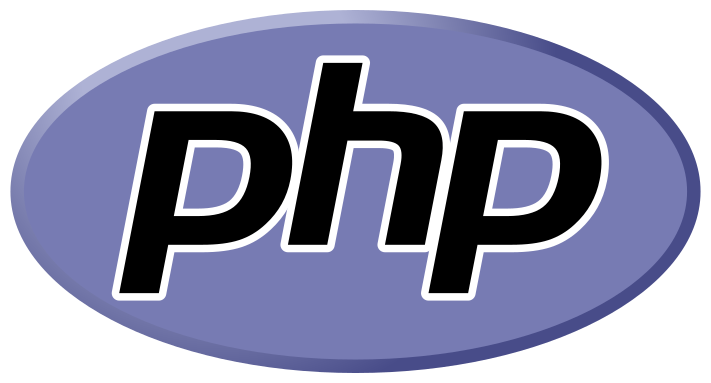

# Juuso "korho" Korhonen
Hiya! I'm a nerd interested in developing and IT stuff. Been since my life, started programming 2014, when 15 years old. You can find my website from mere: https://korho.fi/

### My main projects currently are:
- [Bittivirta](https://bittivirta.fi/) - Hosting, website design, computer repairs, live-streaming services
- [Minespeak](https://minespeak.fi/) - The finnish Minecraft community

### My main languages are:
-  JavaScript
-  PHP
-  HTML
-  CSS

### And favourite libraries, modules and frameworks are:
- Node
- usmanhalalit/pixie (Laravel styled database query builder)
- Bootstrap
- FontAwesome
- Discord.js (+Liora, frameworkish bot)

### I do know basics of these programming languages:
- Java (+maven)
- C#
- Python
- VisualBasic

### Currently studying:
- Next.js
- Python
- Laravel
- Frappe Network
