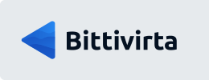

# Juuso "korho" Korhonen
Hiya! I'm an entrepreneur nerd and interested in developing and IT stuff. Been for my whole life, but started programming around 2014, when 14 years old. You can find my website from mere: https://korho.fi/

 

## Main projects / work

 
 

## Main languages
&nbsp;&nbsp;&nbsp;&nbsp;&nbsp;&nbsp;&nbsp;&nbsp;&nbsp;&nbsp;&nbsp;&nbsp;&nbsp;&nbsp;&nbsp;

 

## Favourite libraries, modules and frameworks
*  &nbsp; Node.js
*  &nbsp; Bootstrap
*  &nbsp; FontAwesome
* &nbsp; + &nbsp; usmanhalalit/pixie (Laravel styled database query builder)
* &nbsp; + &nbsp; Discord.js (+Liora, frameworkish bot)

 

## Basics I know of
*  &nbsp; Java (+maven)
*  &nbsp; C#
*  &nbsp; Python
*  &nbsp; VisualBasic

 

## Currently studying
*  &nbsp; Next.js
*  &nbsp; Python
*  &nbsp; Laravel
*  &nbsp; Frappe Framework