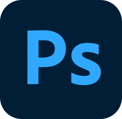

# Juuso "korho" Korhonen

💼 Entrepreneur, sole trader, [Bittivirta](https://bittivirta.fi) 
🧑🏼‍💻 Looking for a job (Hire me, or contact for a quote) 
🤓 Geek since for ever, started programming as an 14 years old kid, 2014 
🖨 Good knowledge of IT, fast learner 
🔍 Tends to take notice on things people normally don't (not sure is this a good or a bad habit)

🇫🇮 From Valkeakoski, Finland 
🳠Finnish as native language, very good grammar 
🏳 Very good English grammar and looking to improve on spoken language

 

## Contact me
Ask me anything, offer for a job or ask for a quote through an email [juuso@korho.fi](juuso@korho.fi)!

 

## Work Experience
- **Computer refurbisher & General manager** at Vstore.fi Parts Oy, *Apr 2018 - Jun 2019 · 1 yr 3 mos* Trainee instructor, office tasks, customer service, computer fixing & installation, and website content updating
- **Sandwich Artist** at Subway Valkeakoski & Tesomaa, *Mar 2018 - Apr 2018 · 2 mos* Customer service, food prepping & sandwich making
- **Entrepreneur, Self-employed at Bittivirta**, *Jul 2016 - Present · +6 yrs* Selling custom made websites, game servers, web hosting, domains, and graphic design. The site was founded early as 2016 for a hobby.

 

## Education
- **Bachelor of Business Administration, Business Information Systems - BBA (210 cr)** Tampere University of Applied Sciences, *Aug 2021 - Present*
- **Computer Software Engineering Courses (64 cr)** JAMK University of Applied Sciences, *2019 - 2020*
- **Business Information Systems Basic egree (180cr)** Valkeakoski Vocational College, *Aug 2015 - Dec 2017*

 

## Main skillsets
&nbsp;&nbsp;&nbsp;&nbsp;&nbsp;
&nbsp;&nbsp;&nbsp;&nbsp;&nbsp;
&nbsp;&nbsp;&nbsp;&nbsp;&nbsp;
&nbsp;&nbsp;&nbsp;&nbsp;&nbsp;
&nbsp;&nbsp;&nbsp;&nbsp;&nbsp;
&nbsp;&nbsp;&nbsp;&nbsp;&nbsp;
&nbsp;&nbsp;&nbsp;&nbsp;&nbsp;
&nbsp;&nbsp;&nbsp;&nbsp;&nbsp;
&nbsp;&nbsp;&nbsp;&nbsp;&nbsp;
&nbsp;&nbsp;&nbsp;&nbsp;&nbsp;
&nbsp;&nbsp;&nbsp;&nbsp;&nbsp;
&nbsp;&nbsp;&nbsp;&nbsp;&nbsp;
&nbsp;&nbsp;&nbsp;&nbsp;&nbsp;
&nbsp;&nbsp;&nbsp;&nbsp;&nbsp;
&nbsp;&nbsp;&nbsp;&nbsp;&nbsp;
 &nbsp; + Linux/Ubuntu servers
 &nbsp; + Windows servers
 &nbsp; + Good knowledge of basic server infrastructures
 &nbsp; + Configuring and debbugging server software
 &nbsp; + Power using of Microsoft Office Word & Excel
 &nbsp; + (Good understanding of video streaming and venue PA's)
 &nbsp; + (Few years of baking and cooking)

 

## Favourite libraries, modules and frameworks
&nbsp;&nbsp;&nbsp;&nbsp;&nbsp;
&nbsp;&nbsp;&nbsp;&nbsp;&nbsp;
&nbsp;&nbsp;&nbsp;&nbsp;&nbsp;
 &nbsp; + [usmanhalalit/pixie](https://github.com/usmanhalalit/pixie) (Laravel styled PHP database query builder)
 &nbsp; + [bramus/router](https://github.com/bramus/router) (Laravel styled PHP router)
 &nbsp; + [Sapphire Framework](https://www.sapphirejs.dev/) ([Discord.js](https://discord.js.org/#/) Framework)

 

## Basics I know of
)&nbsp;&nbsp;&nbsp;&nbsp;&nbsp;
&nbsp;&nbsp;&nbsp;&nbsp;&nbsp;
&nbsp;&nbsp;&nbsp;&nbsp;&nbsp;
&nbsp;&nbsp;&nbsp;&nbsp;&nbsp;

 

## Currently studying
&nbsp;&nbsp;&nbsp;&nbsp;&nbsp;
&nbsp;&nbsp;&nbsp;&nbsp;&nbsp;
&nbsp;&nbsp;&nbsp;&nbsp;&nbsp;